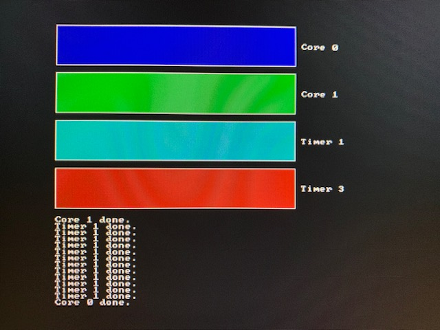

Writing a "bare metal" operating system for Raspberry Pi 4 (Part 13)
====================================================================

[< Go back to part12-wgt](../part12-wgt)

What are interrupts?
--------------------
If you've spent any time looking at the Bluetooth code in these tutorials, you'll notice we're always "polling" for updates. In fact, in _part11-breakout-smp_ we tie up an entire core just waiting around for something to happen. This clearly isn't the best use of CPU time. Fortunately, the world solved that problem for us years ago with _interrupts_.

Ideally, we want to tell a piece of hardware to do something and have it simply notify us when the work is complete so we can move on with our lives in the meantime. These notifications are known as _interrupts_ because they disrupt normal program execution and force the CPU to immediately run an _interrupt handler_.

The simplest device that interrupts
-----------------------------------
One useful piece of built-in hardware is a system timer, which can be programmed to interrupt at regular intervals e.g. every second. You'll need this if you want to schedule multiple processes to run on a single core e.g. using the principle of time slicing.

For now, however, we're simply going to learn how to program the timer and respond to its interrupts.

The codebase
------------
Let me quickly explain what you're looking at in the _part13-interrupts_ code:

 * _boot/_ : the same _boot_ code directory from _part12-wgt_
 * _include/_ : some useful headers copied directly from _part11-multicore_ 
 * _lib/_ : some useful libraries copied directly from _part11-multicore_
 * _kernel/_ : the only new code we need to concern ourselves with in this tutorial

Please note: I have also done some work to tidy up the _Makefile_ and respect this directory structure, but nothing to write home about!

The new code
------------
You'll recognise a lot of _kernel.c_ from _part10-multicore_, except instead of showing four cores at work and playing sound, we're now only using core 0 & 1 and, in addition, making use of two timer interrupts to show four progress bars. So, the `main()` routine kicks off core 1, sets up the timers, and then finally kicks off core 0's workload.

The timers are set up using these calls:

```c
irq_init_vectors();
enable_interrupt_controller();
irq_enable();
timer_init();
```

Initialising the exception vector table
---------------------------------------
In fact, interrupts are a more specific kind of _exception_ - something that, when "raised", needs the immediate attention of the processor. A perfect example of when an exception might occur is when bad code tries to do something "impossible" e.g. divide by zero. The CPU needs to know how to respond when/if this happens i.e. jump to an address of some code to run which handles this exception gracefully e.g. by printing an error to the screen. These addresses are stored in an _exception vector table_.

_irqentry.S_ sets up a list called `vectors` which contains individual _vector entries_. These vector entries are simply jump instructions to handler code.

The CPU is told where this exception vector table is stored during the `irq_init_vectors()` call from `main()` in _kernel.c_. You'll find this code in _utils.S_:

```c
irq_init_vectors:
    adr x0, vectors
    msr vbar_el1, x0
    ret
```

It simply sets the Vector Base Address Register to the address of the `vectors` list.

Interrupt handling
------------------
The only vector entry we really care about for the purposes of this tutorial is `handle_el1_irq`. This is a generic handler for any interrupt request (IRQ) that comes in at EL1 (kernel execution level).

If you do want a deeper understanding, I highly recommend reading s-matyukevich's work [here](https://github.com/s-matyukevich/raspberry-pi-os/blob/master/docs/lesson03/rpi-os.md).

```c
handle_el1_irq:
	kernel_entry
	bl      handle_irq
	kernel_exit
```

Put simply, `kernel_entry` saves the register state before the interrupt handler runs, and `kernel_exit` restores this register state before we return. As we're _interrupting_ normal program execution, we want to be sure that we put things back to how they were so that nothing unpredictable happens as our kernel code resumes.

In the middle we simply call a function called `handle_irq()` which is written in the C language in _irq.c_. Its purpose is to look more closely at the interrupt request, figure out what device was responsible for generating an interrupt, and run the right sub-handler:

```c
void handle_irq() {
    unsigned int irq = REGS_IRQ->irq0_pending_0;

    while(irq) {
        if (irq & SYS_TIMER_IRQ_1) {
            irq &= ~SYS_TIMER_IRQ_1;

            handle_timer_1();
        }

        if (irq & SYS_TIMER_IRQ_3) {
            irq &= ~SYS_TIMER_IRQ_3;

            handle_timer_3();
        }
    }
}
```

As you can see, we're handling two different timer interrupts in this code. In fact, `handle_timer_1()` and `handle_timer_3()` are implemented in _kernel.c_ and serve to demonstrate that the timer has fired by incrementing a progress counter and updating a graphical representation of its value. Timer 3 is configured to progress at 4 times the speed of Timer 1.

The interrupt controller
------------------------
The interrupt controller is the hardware responsible for telling the CPU about interrupts as they occur. We can use the interrupt controller to act as a gatekeeper and allow/block (or enable/disable) interrupts. We can also use it to figure out which device generated the interrupt, as we did in `handle_irq()`.

In `enable_interrupt_controller()`, called from `main()` in _kernel.c_, we allow the Timer 1 and Timer 3 interrupts through and in `disable_interrupt_controller()` we block all interrupts:

```c
void enable_interrupt_controller() {
    REGS_IRQ->irq0_enable_0 = SYS_TIMER_IRQ_1 | SYS_TIMER_IRQ_3;
}

void disable_interrupt_controller() {
    REGS_IRQ->irq0_enable_0 = 0;
}
```

Masking/unmasking interrupts
----------------------------
To begin receiving interrupts, we need to take one more step: unmasking all types of interrupts.

Masking is a technique used by the CPU to prevent a particular piece of code from being stopped in its tracks by an interrupt. It's used to protect important code that *must* complete. Imagine what would happen if our `kernel_entry` code (that saves register state) was interrupted halfway through! In this case, the register state would be overwritten and lost. This is why the CPU automatically masks all interrupts when an exception handler is executed.

The `irq_enable` and `irq_disable` functions in _utils.S_ are responsible for masking and unmasking interrupts:

```c
.globl irq_enable
irq_enable:
    msr daifclr, #2
    ret

.globl irq_disable
irq_disable:
    msr daifset, #2
    ret
```

As soon as `irq_enable()` is called from `main()` in _kernel.c_, the timer handler is run when the timer interrupt fires. Well, sort of...!

Initialising the system timer
-----------------------------
We still need to initialise the timer.

The RPi4's system timer couldn't be simpler. It has a counter which increases by 1 with each clock tick. It then has 4 interrupt lines (0 & 2 reserved for the GPU, 1 & 3 used by us in this tutorial!) with 4 corresponding compare registers. When the value of the counter becomes equal to a value in one of the compare registers, the corresponding interrupt is fired.

So before we receive any timer interrupts, we must also set the right compare registers to have a non-zero value. The `timer_init()` function (called from `main()` in _kernel.c_) gets the current timer value, adds the timer interval and sets the compare register to that total, so when the right number of clock ticks pass, the interrupt fires. It does this for both Timer 1 and Timer 3, setting Timer 3 to run 4 times as fast.

Handling the timer interrupts
-----------------------------
This is the simplest bit.

We update the compare register so the next interrupt will be generated after the same interval again. Importantly we then acknowledge the interrupt by setting the right bit of the Control Status register.

Then we update the screen to show our progress!

_And... hey presto! You're handling two system timer interrupts like a pro!_



[Go to part14-spi-ethernet >](../part14-spi-ethernet)
