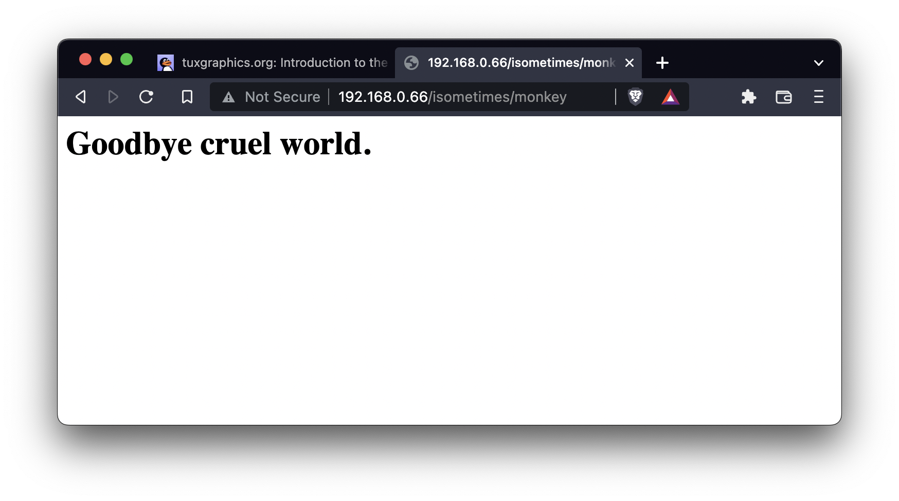

Writing a "bare metal" operating system for Raspberry Pi 4 (Part 15)
====================================================================

[< Go back to part14-spi-ethernet](../part14-spi-ethernet)

Adding a TCP/IP stack
---------------------
Having achieved "proof of life" from our Ethernet module in _part14-spi-ethernet_, you're doubtless wondering how to go from there to serving web pages, posting tweets on Twitter or perhaps even just simply responding to a ping!

This is where you'll need a fully-fledged TCP/IP stack that goes way beyond handcrafted ARPs, implementing many more protocols to achieve efficient bi-directional communication.

In this part we make use of some code from Guido Socher of [tuxgraphics.org](http://tuxgraphics.org/), designed to be a lightweight TCP/IP stack for embedded devices. I chose this because it was super simple to get working (or "port"), but you might want to look at [LwIP](https://en.wikipedia.org/wiki/LwIP) if you need something more advanced.

The code
--------
Most of the new code is in the _tcpip/_ subdirectory. I actually came across it in [this tarball](http://tuxgraphics.org/common/src2/article09051/eth_tcp_client_server-dhcp-5.10.tar.gz) and, again, made only a very few cosmetic changes (`diff` is your friend!).

It did require me to expose the `strlen()` function we implemented in _lib/fb.c_, so that's added to _include/fb.h_. Similarly, we expose the `memcpy()` function we implemented in _kernel/kernel.c_, so that's added to _kernel/kernel.h_.

I also needed a single function that tells the ENC to send a packet. Nothing new here, just different packaging:

```c
void enc28j60PacketSend(unsigned short buflen, void *buffer) {
   if (ENC_RestoreTXBuffer(&handle, buflen) == 0) {
      ENC_WriteBuffer((unsigned char *) buffer, buflen);
      handle.transmitLength = buflen;
      ENC_Transmit(&handle);
   }
}
```

This was also added to _kernel/kernel.h_.

What happened to _arp.c_?
-------------------------
You'll notice that I've merged _arp.c_ and _kernel.c_. I have also gone away from doing anything wih multicore or IRQ timers to keep this kernel simple. We still initialise the network card in exactly the same way but, when we're done, we call this function in Guido's code:

```c
init_udp_or_www_server(myMAC, deviceIP);
```

This tells the TCP/IP library who we are, so we're all on the same page!

Finally, and aside from a little cleanup (eg. moving the HAL/system timer functions to _lib/io.c_ with the commensurate changes to _include/io.h_), the major change is the new `serve()` function:

```c
void serve(void)
{
   while (1) {
      while (!ENC_GetReceivedFrame(&handle));

      uint8_t *buf = (uint8_t *)handle.RxFrameInfos.buffer;
      uint16_t len = handle.RxFrameInfos.length;
      uint16_t dat_p = packetloop_arp_icmp_tcp(buf, len);

      if (dat_p != 0) {
         debugstr("Incoming web request... ");

         if (strncmp("GET ", (char *)&(buf[dat_p]), 4) != 0) {
            debugstr("not GET");
            dat_p = fill_tcp_data(buf, 0, "HTTP/1.0 401 Unauthorized\r\nContent-Type: text/html\r\n\r\n<h1>ERROR</h1>");
         } else {
            if (strncmp("/ ", (char *)&(buf[dat_p+4]), 2) == 0) {
               // just one web page in the "root directory" of the web server
               debugstr("GET root");
               dat_p = fill_tcp_data(buf, 0, "HTTP/1.0 200 OK\r\nContent-Type: text/html\r\n\r\n<h1>Hello world!</h1>");
            } else {
               // just one web page not in the "root directory" of the web server
               debugstr("GET not root");
               dat_p = fill_tcp_data(buf, 0, "HTTP/1.0 200 OK\r\nContent-Type: text/html\r\n\r\n<h1>Goodbye cruel world.</h1>");
            }
         }

         www_server_reply(buf, dat_p); // send web page data
         debugcrlf();
      }
   }
}
```

This is an infinite loop which waits for an incoming packet and then firstly passes it to Guido's `packetloop_arp_icmp_tcp()` function. This function implements some useful things, like responding to pings. I modified the routine to print a message to the screen when it sends a "pong" (look from line 1371 of _tcpip/ip_arp_udp_tcp.c_), so we can see when it's in action!

Examining the return value of `packetloop_arp_icmp_tcp()` then allows us to check whether there is an incoming web request, since we've configured the TCP/IP library to be a web server in _tcpip/ip_config.h_ with `#define WWW_server`.

We then serve responses based on three possible cases:

 * The incoming request is not a GET request (eg. maybe it's a HEAD request) - you can simulate this using the `curl` tool: `curl -I 192.168.0.66`
 * The incoming request is a GET request for the root web page `/` - `curl 192.168.0.66/`
 * The incoming request is a GET request for any non-root web page - eg. `curl 192.168.0.66/isometimes/monkey`

I recommend reading [this page](http://tuxgraphics.org/electronics/200905/embedded-tcp-ip-stack.shtml) for a full explanation. The code I have ported is very similar to what you see there.

_Imagine my excitement when I built, ran and could ping my RPi4 at 192.168.0.66 and get a web response to my browser on both my laptop and my iPhone!_



