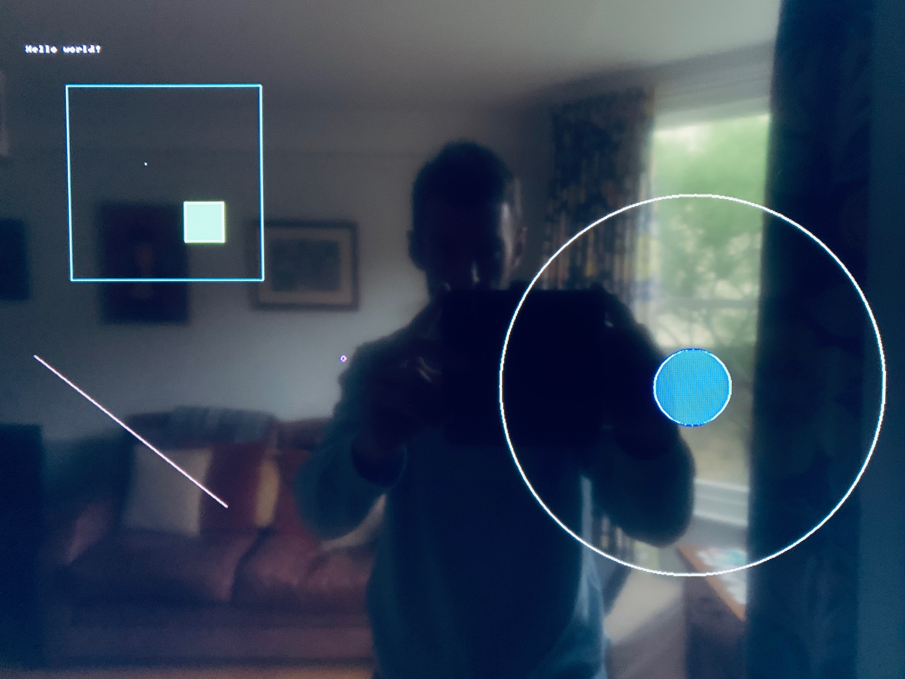

Writing a "bare metal" operating system for Raspberry Pi 4 (Part 5)
===================================================================

[< Go back to part4-miniuart](../part4-miniuart)

Working with the screen
-----------------------

As exciting as the UART is, in this tutorial we're finally going to get "Hello world!" up on the screen! Now that we're experts in MMIO, we're ready to tackle **mailboxes**. This is how we communicate with the VideoCore multimedia processor. We can send it messages, and it can reply. Think of it just like email.

Let's create _mb.c_:

```c
#include "io.h"

// The buffer must be 16-byte aligned as only the upper 28 bits of the address can be passed via the mailbox
volatile unsigned int __attribute__((aligned(16))) mbox[36];

enum {
    VIDEOCORE_MBOX = (PERIPHERAL_BASE + 0x0000B880),
    MBOX_READ      = (VIDEOCORE_MBOX + 0x0),
    MBOX_POLL      = (VIDEOCORE_MBOX + 0x10),
    MBOX_SENDER    = (VIDEOCORE_MBOX + 0x14),
    MBOX_STATUS    = (VIDEOCORE_MBOX + 0x18),
    MBOX_CONFIG    = (VIDEOCORE_MBOX + 0x1C),
    MBOX_WRITE     = (VIDEOCORE_MBOX + 0x20),
    MBOX_RESPONSE  = 0x80000000,
    MBOX_FULL      = 0x80000000,
    MBOX_EMPTY     = 0x40000000
};

unsigned int mbox_call(unsigned char ch)
{
    // 28-bit address (MSB) and 4-bit value (LSB)
    unsigned int r = ((unsigned int)((long) &mbox) &~ 0xF) | (ch & 0xF);

    // Wait until we can write
    while (mmio_read(MBOX_STATUS) & MBOX_FULL);
    
    // Write the address of our buffer to the mailbox with the channel appended
    mmio_write(MBOX_WRITE, r);

    while (1) {
        // Is there a reply?
        while (mmio_read(MBOX_STATUS) & MBOX_EMPTY);

        // Is it a reply to our message?
        if (r == mmio_read(MBOX_READ)) return mbox[1]==MBOX_RESPONSE; // Is it successful?
           
    }
    return 0;
}
```

First we include _io.h_ as we need access to the `PERIPHERAL_BASE` definition and also to make use of the `mmio_read` and `mmio_write` functions that _io.c_ provides. Our previous MMIO experience is useful here, as sending/receiving mailbox request/responses is achieved using the same technique. We'll just be addressing different offsets from `PERIPHERAL_BASE`, as you see in the code.

Importantly, our mailbox buffer (where messages will be stored) needs to be correctly aligned in memory. This is one example where we need to be strict with the compiler instead of letting it do its thing! By ensuring the buffer is "16-byte aligned", we know that its memory address is a multiple of 16 i.e. the 4 least significant bits are not set. That's good, because only the 28 most significant bits can be used as the address, leaving the 4 least significant bits to specify the **channel**.

I recommend reading up on the [mailbox property interface](https://github.com/raspberrypi/firmware/wiki/Mailbox-property-interface). You'll see that channel 8 is reserved for messages from the ARM for response by the VideoCore, so we'll be using this channel.

`mbox_call` implements all the MMIO we need to send the message (assuming it's been set up in the buffer) and await the reply. The VideoCore will write the reply directly to our original buffer.

The framebuffer
---------------

Now take a look at _fb.c_. The `fb_init()` routine makes our very first mailbox call, using some definitions from _mb.h_. Remember the email analogy? Well, since it's possible to ask a person to do more than one thing by email, we can also ask a few things of the VideoCore at once. This message asks for two things:

 * A pointer to the framebuffer start (`MBOX_TAG_GETFB`)
 * The pitch (`MBOX_TAG_GETPITCH`)

You can read more about the message structure on the [mailbox property interface](https://github.com/raspberrypi/firmware/wiki/Mailbox-property-interface) page that I shared before.

A **framebuffer** is simply an area of memory that contains a bitmap which drives a video display. In other words, we can manipulate the pixels on the screen directly by writing to specific memory addresses. We will first need to understand how this memory is organised though.

In this example, we ask the VideoCore for:

 * a simple 1920x1080 (1080p) framebuffer
 * a depth of 32 bits per pixel, with an RGB pixel order

So each pixel is made up of 8-bits for the Red value, 8-bits for Green, 8-bits for Blue and 8-bits for the Alpha channel (representing transparency/opacity). We're asking that the pixels are ordered in memory with the Red byte coming first, then Green, then Blue - RGB. In actual fact, the Alpha byte always comes ahead of all of these, so it's really ARGB.

We then send the message using channel 8 (`MBOX_CH_PROP`) and check that what the VideoCore sends back is what we asked for. It should also tell us the missing piece of the framebuffer organisation puzzle - the number of bytes per line or **pitch**.

If everything comes back as expected, then we're ready to write to the screen!

Drawing a pixel
---------------

To save us remembering RGB colour combinations, let's set up a simple 16-colour **palette**. Anyone remember the old [EGA/VGA palette](https://en.wikipedia.org/wiki/Enhanced_Graphics_Adapter)? If you take a look in _terminal.h_, you'll see the `vgapal` array sets up that same palette, with Black as item 0 and White as item 15, and many shades in between!

Our `drawPixel` routine can then take an (x, y) coordinate and a colour. We use an `unsigned char` (8 bits) to represent two palette indexes at once, with the 4 most significant bits representing the background colour and the 4 least significant bits, the foreground colour. You may see why it's helpful to have only a 16-colour palette for now!

```c
void drawPixel(int x, int y, unsigned char attr)
{
    int offs = (y * pitch) + (x * 4);
    *((unsigned int*)(fb + offs)) = vgapal[attr & 0x0f];
}
```

We first calculate the framebuffer offset in bytes. (y * pitch) gets us to coordinate (0, y) - pitch is the number of bytes per line. We then add (x * 4) to get to (x, y) - there are 4 bytes (or 32 bits!) per pixel (ARGB). We can then set that byte in the framebuffer to our foreground colour (we don't need a background colour here).

Drawing lines, rectangles and circles
-------------------------------------

Examine and understand our `drawRect`, `drawLine` and `drawCircle` routines now. Where a polygon is filled, we use the background colour for the fill and the foreground colour for the outline.

I recommend reading [Bresenham](https://en.wikipedia.org/wiki/Bresenham%27s_line_algorithm) on drawing graphics primitives. My line and circle drawing algorithms come from him, and they're designed to use only simple mathematics. He makes for very interesting reading and his algorithms are still very important today.

Writing characters to the screen
--------------------------------

I told you that nothing is for free in bare metal programming, right? Well, if we want to write a message to the screen then we need a font. So, just like we built our palette, we now need to build up a font for our code to use. Luckily, fonts are just arrays of simple **bitmaps** - 1's and 0's used to describe a picture. We're going to define an 8x8 font similar to the one MS-DOS used.

Imagine an 8x8 "A":

```c
0 0 0 0 1 1 0 0 = 0x0C
0 0 0 1 1 1 1 0 = 0x1E
0 0 1 1 0 0 1 1 = 0x33
0 0 1 1 0 0 1 1 = 0x33
0 0 1 1 1 1 1 1 = 0x3F
0 0 1 1 0 0 1 1 = 0x33
0 0 1 1 0 0 1 1 = 0x33
0 0 0 0 0 0 0 0 = 0x00
```

This bitmap can be represented by just 8 bytes (the hexadecimal numbers after the = signs). When you look in _terminal.h_, you'll see that we've done this for many of the useful characters found in [code page 437](https://en.wikipedia.org/wiki/Code_page_437).

`drawChar` should now be fairly self-explanatory. 

 * We set a pointer `glyph` to the bitmap of the character we're looking to draw
 * We iterate over the bitmap array, starting with the first row, then second, then third etc.
 * For each pixel in the row, we determine whether it should be set to the background colour (the corresponding glyph bit is 0) or the foregound colour (the bit is 1)
 * We draw the appropriate pixel at the right coordinates

`drawString` unsurprisingly uses `drawChar` to print a whole string.

Updating our kernel to be more artistic
---------------------------------------

Finally, we can create a work of art on-screen! Our updated _kernel.c_ exercises all these graphics routines to draw the picture below.

Build the kernel, copy it to your SD card. You may need to update your _config.txt_ once more. If you previously set the `hdmi_safe` parameter to get Raspbian going, you probably won't need it now. You might, however, need to set `hdmi_mode` and `hdmi_group` specifically to ensure we get into 1080p mode.

It's a good time to gain an understanding of the [screen resolution settings](https://pimylifeup.com/raspberry-pi-screen-resolution/) for the RPi4. Because I'm using a regular TV, my _config.txt_ file now contains three lines (including the one we already added for the UART):

```c
core_freq_min=500
hdmi_group=1
hdmi_mode=16
```

Now fire up the RPi4!

_We've done so much more than a basic "Hello world!" on-screen already!_ Sit back, relax and enjoy your artwork. In the next tutorial, we'll be combining graphics with keyboard input from the UART to create our first game.



[Go to part6-breakout >](../part6-breakout)
