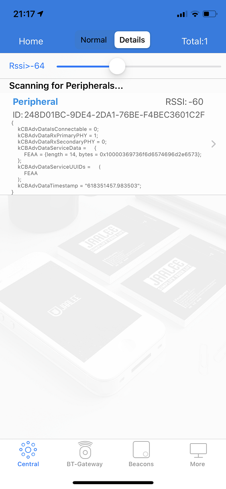
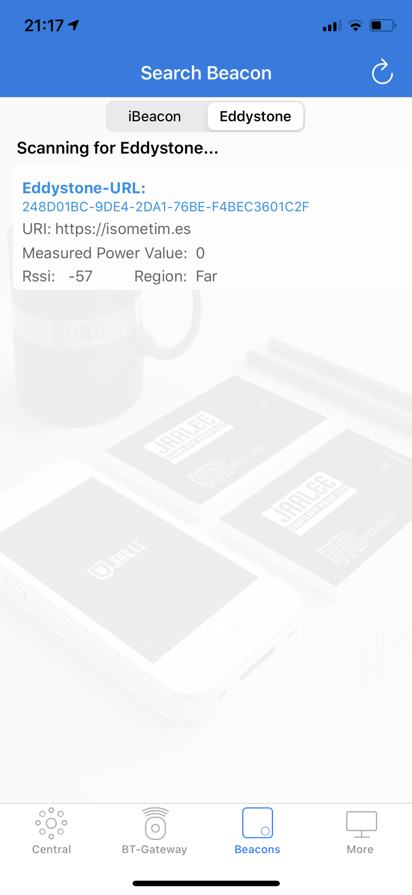

Writing a "bare metal" operating system for Raspberry Pi 4 (Part 7)
===================================================================

Getting Bluetooth up
--------------------

Controlling the RPi4 solely via a UART-connected laptop is not much fun. Our Breakout game deserves a better controller than that - ideally a wireless one.

In this part, we set up a second UART to communicate with the RPi4's onboard Bluetooth modem. There is nothing simple about Bluetooth, but it is at least simpler than USB, and that's the reason I've chosen to pursue it.

The Broadcom firmware
---------------------

The Bluetooth modem is a Broadcom chip (BCM43455), and it needs to be loaded with proprietary software before it's useful to us. I have taken their _BCM4345C0.hcd_ file from the [Bluez repo](https://github.com/RPi-Distro/bluez-firmware/tree/master/broadcom).

As we don't yet have any filesystem, we won't be able to load this at runtime, so instead we'll need to build it into our kernel. We can use `objcopy` to build a _.o_ file that we can link. We add these lines to _Makefile_:

```c
BCM4345C0.o : BCM4345C0.hcd
	$(GCCPATH)/aarch64-none-elf-objcopy -I binary -O elf64-littleaarch64 -B aarch64 $< $@
```

We also need to modify our `kernel8.img` dependencies to include our new _.o_ file:

```c
kernel8.img: boot.o $(OFILES) BCM4345C0.o
	$(GCCPATH)/aarch64-none-elf-ld -nostdlib -nostartfiles boot.o $(OFILES) BCM4345C0.o -T link.ld -o kernel8.elf
	$(GCCPATH)/aarch64-none-elf-objcopy -O binary kernel8.elf kernel8.img
```

If you build the kernel now, you'll see that the new image is much bigger - because it contains the firmware bytes. You can run `objdump -x kernel8.elf`, and you'll also see a few new symbols in there:

 * _binary_BCM4345C0_hcd_start
 * _binary_BCM4345C0_hcd_size
 * _binary_BCM4345C0_hcd_end

We'll use these symbols later to reference the firmware from our C code.

Setting up the UART
-------------------

Look at our new _bt.c_. We'll focus on the `// UART0` section for now. A lot of the techniques will be familiar to you as this hardware also uses the MMIO technique, and we're implementing a lot of the same functions that we did to get our serial debug working.

To use Bluetooth at the same time as our serial debug, we'll need to remap some GPIO pins. Pins 30, 31, 32 and 33 will all need to take on their _alternate function 3_ to give us access to CTS0, RTS0, TXD0 and RXD0.  You can read all about this in Section 5.3 of the [BCM2711 ARM Peripherals document](https://www.raspberrypi.org/documentation/hardware/raspberrypi/bcm2711/rpi_DATA_2711_1p0.pdf).

We already have a function in _io.c_ to do this, and so we add the function definition of `gpio_useAsAlt3` to _io.h_ to give us access to it from here. In `bt_init()`, we go ahead and remap the GPIO pins, then flush the receive buffer just to be safe. The MMIO writes which follow, set us up for 115200 baud and [8-N-1 communication](https://en.wikipedia.org/wiki/8-N-1) - we know the Bluetooth modem can cope with this. Perhaps the most important line to get right was this one:

```c
mmio_write(ARM_UART0_CR, 0xB01);
```

It enables the UART (bit 0 on), enables TX & RX (bits 8 & 9 on), and drives RTS0 low (bit 11 on) - very important as the Bluetooth modem will sit unresponsive until it sees this. **I lost a lot of time figuring this one out.**

We should now be able to talk to the Bluetooth modem over our new UART.

Talking to the Bluetooth modem
------------------------------

The Bluetooth spec is massive, and to implement a full driver would take a long while. I'll settle for "proof of life" for now. We still have a way to travel though...

We talk to the Bluetooth modem using **HCI commands**. I enjoyed reading the [TI HCI docs](http://software-dl.ti.com/simplelink/esd/simplelink_cc13x2_sdk/1.60.00.29_new/exports/docs/ble5stack/vendor_specific_guide/BLE_Vendor_Specific_HCI_Guide/hci_interface.html) as an intro to this.

`bt_reset()` simply calls `hci_Command`, which in turn called `hci_CommandBytes` to write the bytes out to the UART that tell the Bluetooth chip to reset and await firmware. This is a vendor-specific call, so you won't find it documented anywhere. `hci_CommandBytes` then waits for a very specific response before it returns successfully - the "command complete" response.

Loading the firmware
--------------------

Now the device is waiting. We need to send it the firmware bytes we included in our kernel:

```c
void bt_loadfirmware()
{
    if (!hciCommand(OGF_VENDOR, COMMAND_LOAD_FIRMWARE, empty, 0)) uart_writeText("loadFirmware() failed\n");

    extern unsigned char _binary_BCM4345C0_hcd_start[];
    extern unsigned char _binary_BCM4345C0_hcd_size[];

    unsigned int c=0;
    unsigned int size = (long)&_binary_BCM4345C0_hcd_size;

    while (c < size) {
        unsigned char opcodebytes[] = { _binary_BCM4345C0_hcd_start[c], _binary_BCM4345C0_hcd_start[c+1] };
        unsigned char length = _binary_BCM4345C0_hcd_start[c+2];
        unsigned char *data = &(_binary_BCM4345C0_hcd_start[c+3]);

        if (!hciCommandBytes(opcodebytes, data, length)) {
	   uart_writeText("Firmware data load failed\n");
	   break;
	}
	c += 3 + length;
    }

    wait_msec(0x100000);
}
```

First, we send a command to tell the chip that we're about send the firmware. You'll see that we then reference our new symbols, which point us at our firmware bytes. We now know the size of the firmware, and so we iterate over it.

The firmware is simply a sequence of HCI commands following this format:

 * 2 bytes of opcode 
 * 1 byte that tells us the length of the data to follow
 * _length_ bytes of data

We check each HCI command succeeds as we go, wait a second and then return. If it runs without error then we've loaded our firmware and we're ready to start some Bluetooth communications!

Todo
----

 * Write up scanning implementation (receiving advertising reports)
 * Write up advertising implementation (simple Eddystone Beacon)



